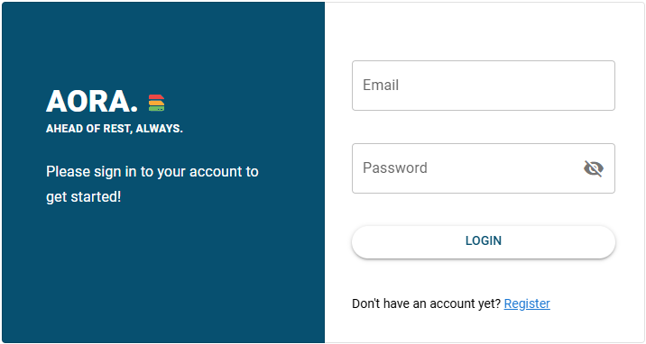

# Aora | Ahead Of Rest, Always.

## 📜 About

Aora is an application designed to leverage AI for advanced document handling and natural language processing. This repository contains both backend and frontend components to get the application up and running.



## 📟 Recommended Setup

Highly recommended:

- [VSCode](https://code.visualstudio.com/)
- [Python](https://www.python.org/downloads/)
- [Docker](https://www.docker.com/get-started)
- [Node](https://nodejs.org/en/download/package-manager)
- [Vue - Official](https://marketplace.visualstudio.com/items?itemName=Vue.volar) by Vue: Inter alia code formatter used for Vue.
  - 🛑 Attention: Disable Vetur!
  - Remark: The extension is also called **Volar**.
- [Prettier](https://marketplace.visualstudio.com/items?itemName=esbenp.prettier-vscode)

Further helpful VSCode extensions:

- [Vue.js Extension Pack](https://marketplace.visualstudio.com/items?itemName=mubaidr.vuejs-extension-pack)
- [Vue 3 Snippets](https://marketplace.visualstudio.com/items?itemName=hollowtree.vue-snippets)
- [Peacock](https://marketplace.visualstudio.com/items?itemName=johnpapa.vscode-peacock)

📑 Note: The VSCode `settings.json` is pushed to git. In order to properly use the defined formatting settings, you definitely will need the above mentioned extension.

## ⚙ Project Setup

### Clone the Git repository

```sh
git clone https://github.com/tmeftah/Aora.git
```

### Setup Backend

- **Navigate to the backend directory:**

  ```bash
  cd backend/
  ```

- **Create a virtual environment:**

  ```bash
  python -m venv venv
  ```

- **Activate the virtual environment:**

  - On Windows:
    ```bash
    venv\Scripts\activate
    ```
  - On macOS/Linux:
    ```bash
    source venv/bin/activate
    ```

- **Install all required packages:**

  ```bash
  pip install -r requirements.txt
  ```

- **Run the development server:**

  ```bash
  fastapi dev
  ```

### Setup Frontend

- **Navigate to the frontend directory:**

  ```bash
  cd frontend
  ```

- **Install all necessary packages:**

  ```bash
  npm install
  ```

- **Run the development server:**

  ```bash
  npm run dev
  ```

#### Create Embeddings

To create a vector datastore of your documents, you need follow this steps:

1.  Inside the **'backend/'** folder create folder named 'docs' and add you pdf documents.
2.  run following command

```bash
cd backend
```

Now run the create_embeddings file to create embeddings.

```bash
python create_embeddings.py # create embeddings.
```

## 📚 Configuration Settings

### Backend Environment Configuration

- Create an `.env` file inside the `backend` folder with the following settings:

  ```env
  LLM_API_KEY = "<API_KEY>"
  LLM_API_BASE_URL = "<BASE_URL>"

  ```

### Frontend Environment Configuration

- Create an `.env` file inside the `frontend` folder with the following settings for the UI:

  ```env
  API=http://ip-address-of-api:port
  ```

## License

This project is licensed under the MIT License.

## Contact

This project is a part of the GenAI project.
In case there are any questions, please contact Nikhil Raikar or Tarek Meftah
